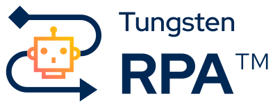

# Welcome to the Tungsten RPA Github Repository
 Tungsten RPA enables the automation of labor-intensive, multi-step tasks across systems and data sources with no coding. It leverages an enterprise-class, server-based approach that is resilient, highly scalable and only uses desktops when really needed.  

## Learn 
### Complete Guide to Building a Robot
This is a step-by-step guide to building a robust robot showing the use of guards, aliases, loops, loops in loops, database connections, expressions and more. 
[[presentation and video](https://play.vidyard.com/zxsZLeBzzZpnu9qbEZVRwh)] [[download robot](https://github.com/TungstenRPA/Hansard-Robot)]
### Community (Q&A Forum)
Connect with your peers, ask or answer questions, share best practices and learn from others.
[[Tungsten RPA Community](https://community.kofax.com/s/topic/0TO3m000000IznGGAS/rpa)]
### Best Practices
Compilation of [Best Practices for Robots](https://github.com/TungstenRPA/RPA-Best-Practices#readme) 
## Product Releases
### [Tungsten RPA 11.5](https://github.com/TungstenRPA/11.5)
[[Download](https://delivery.tungstenautomation.com)] [[Documentation](https://docshield.tungstenautomation.com/Portal/Products/en_US/RPA/11.5.0-nlfihq5gwr/RPA.htm)] [[Release Notes](https://docshield.tungstenautomation.com/RPA/en_US/11.5.0-nlfihq5gwr/help/rpa_rn/index.html)] [[Free Trial License](https://www.tungstenautomation.com/products/rpa/rpa-free-trial)] [[DockerHub](https://hub.docker.com/u/tungstenautomation)]  [[Knowledge Portal Quick Links](https://knowledge.tungstenautomation.com/bundle/z-kb-articles-salesforce9/page/34865.html)]
* Tungsten RPA 11.5 was released on Oct 04, 2023
  * [What's New in RPA 11.5](https://docshield.tungstenautomation.com/RPA/en_US/11.5.0-nlfihq5gwr/help/rpa_rn/rpa_releasenotes/c_newfeatures.html)
* Tungsten RPA 11.5.0.6 was released on Feb 08, 2025
  * [RPA 11.5.0 Fix Pack 6 Release Notes](https://docshield.tungstenautomation.com/RPA/en_US/11.5.0-nlfihq5gwr/print/ReadMe-KofaxRPA-11.5.0.6.htm)
### Kofax RPA 11.4
 [[Download](https://delivery.tungstenautomation.com)] [[Documentation](https://docshield.tungstenautomation.com/Portal/Products/en_US/RPA/11.4.0-vcsft2fhaw/RPA.htm)] [[Release Notes](https://docshield.tungstenautomation.com/RPA/en_US/11.4.0-vcsft2fhaw/help/rpa_rn/index.html)] [[Free Trial License](https://www.tungstenautomation.com/products/rpa/rpa-free-trial)] [[DockerHub](https://hub.docker.com/u/tungstenautomation)] [[Knowledge Portal Quick Links](https://knowledge.tungstenautomation.com/bundle/z-kb-articles-salesforce9/page/34865.html)]
* Kofax RPA 11.4 was released on 17 Jan 2023
  * [What's New in RPA 11.4](https://docshield.tungstenautomation.com/RPA/en_US/11.4.0-vcsft2fhaw/help/rpa_rn/rpa_releasenotes/c_newfeatures.html)
* Kofax RPA 11.4.0.6 was released on Jan 17, 2025
  * [RPA 11.4.0 Fix Pack 6 Release Notes](https://docshield.tungstenautomation.com/RPA/en_US/11.4.0-vcsft2fhaw/print/ReadMe-KofaxRPA-11.4.0.6.htm)
* Key New Features
  *	OAuth Authentication now supported for [Microsoft 365 Mail](https://github.com/TungstenRPA/Mail/blob/master/Microsoft365.md) via Triggers in MC. NOT in Mail Step in Robots.
  *	Desktop Automation Service can use OAuth to authenticate with Management Console.
  *	[Kapplets](https://github.com/TungstenRPA/Docker/blob/6b954e9188e3828183b9e9e6ce37afe4b3cde62a/docker-compose.yml) now works on Docker
  *	“Quick RPA for KTA”. This is a new feature of KTA, that creates KTA objects equivalent to the Robot input and output types.
  *	Document Transformation Service has been upgraded to the latest version of Kofax Transformation: Kofax Omnipage is default OCR. Finereader has been removed.
  *	Classic Browser deprecation in Basic Engine Robot. Very old robots should migrate to Web-kit.
  *	Kapplet error handling has been improved.
### Kofax RPA 11.3
 [[Download](https://delivery.tungstenautomation.com)] [[Documentation](https://docshield.tungstenautomation.com/Portal/Products/en_US/RPA/11.3.0_5cdzhlgb3t/RPA.htm)] [[Release Notes](https://docshield.tungstenautomation.com/RPA/en_US/11.3.0_5cdzhlgb3t/help/rpa_rn/index.html)] [[Free Trial License](https://www.tungstenautomation.com/products/rpa/rpa-free-trial)] [[DockerHub](https://hub.docker.com/u/tungstenautomation)] [[Knowledge Portal Quick Links](https://knowledge.tungstenautomation.com/bundle/z-kb-articles-salesforce9/page/34865.html)]
* Kofax RPA 11.3 was released on May 5, 2022
  * [What's New in RPA 11.3](https://docshield.tungstenautomation.com/RPA/en_US/11.3.0_5cdzhlgb3t/help/rpa_rn/rpa_releasenotes/c_newfeatures.html)
  * [What's New in RPA 11.3 presentation](https://github.com/TungstenRPA/RPA-11.3). [[New in 11.2](https://github.com/TungstenRPA/RPA-11.2)] [[New in 11.1](https://github.com/TungstenRPA/RPA-11.1)] 
* Kofax RPA 11.3.0.6 was released on May 16, 2024
  * [RPA 11.3.0 Fix Pack 6 Release Notes](https://docshield.tungstenautomation.com/RPA/en_US/11.3.0_5cdzhlgb3t/print/ReadMe-KofaxRPA-11.3.0.6.htm)
## Useful Links
* How to [queue a robot job](https://github.com/TungstenRPA/RPA-11.1/blob/main/RobotQueueing.md#robot-queueing-in-kofax-rpa) from an external application or from another robot. This makes asynchronous robot calling possible and does not consume an extra license as happens when a robot **calls** another robot synchronously
* [[Install RPA & Kapplets on Tomcat](https://github.com/TungstenRPA/RPA-Best-Practices/wiki/Install-Kofax-RPA-11.3-on-Apache-Tomcat-on-Windows)]
* [Tungsten RPA](https://community.kofax.com/s/topic/0TO3m000000IznGGAS/robotic-process-automation) at [Tungsten Community](https://community.kofax.com).
* Git/GitHub/BitBucket/etc integration with [Robot Lifecycle Management](https://github.com/TungstenRPA/Robot-Lifecycle-Management-Guide)
* [Free download with free 3 month license](https://www.tungstenautomation.com/products/rpa/rpa-free-trial).
  * [How to build your first robot](https://www.tungstenautomation.com/-/media/files/e-books/en/ug_rpa-tutorial-guide-_en.pdf)
  * [Video tutorials](https://www.tungstenautomation.com/eg/kofax-rpa-tutorials)
* [Product Homepage](https://www.tungstenautomation.com/products/rpa).
* Share your assets on [Kofax MarketPlace](https://marketplace.tungstenautomation.com/).
* [Read emails](https://github.com/TungstenRPA/RPA-11.1/blob/main/Enhanced%20Email%20Integration.md#enhanced-email-integration-in-kofax-rpa-111) via Management Console.
* [Request a customer portal account](https://knowledge.kofax.com/General_Support/00_Support_Forms/Customer_Portal_Request?_ga=2.130987279.1656012013.1655202293-294255832.1654091170)
## Connectors for Custom Actions
 * [Documentation](https://docshield.tungstenautomation.com/RPA/en_US/11.4.0-vcsft2fhaw/help/rpa_help/help_main/designstudio/c_das_customactionstep.html) for building connectors in node.js, python, shell or exe programs.
 * [Office2PDF Connector](https://github.com/TungstenRPA/RPA-Connector-Office2PDF).
 * [Filesystem Connector](https://github.com/TungstenRPA/RPA-Connector-File-System) **(made redundant in 11.3 by [File System Action](https://docshield.tungstenautomation.com/RPA/en_US/11.4.0-vcsft2fhaw/help/rpa_help/help_main/designstudio/c_das_filesystemactionstep.html))**.
 * [SAP RFC Connector](https://github.com/TungstenRPA/RPA-Connector-RFC).
 * [Zip Connector](https://github.com/TungstenRPA/RPA-Connector-Zip).
 

This GitHub account is managed by Tungsten Automation Sales Enablement.

Visit also our [TungstenTransformation repository](https://github.com/TungstenTransformation).
